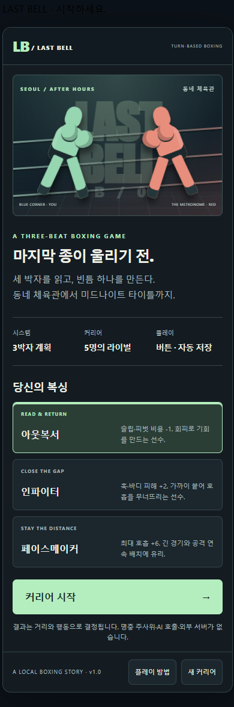

# LAST BELL · 마지막 종

**RisuAI에서 IMPORT해서 플레이하는, 한국어 3박자 계획형 턴제 복싱 게임입니다.**

상대의 예고를 읽고 내 행동 세 개를 순서대로 배치하세요. 동네 체육관에서 다섯 명의 라이벌을 꺾고 미드나이트 챔피언에 도전합니다. 버튼 플레이에는 API 키, LLM 호출, 별도 서버, 이미지 다운로드가 필요하지 않습니다.



## 가져오기

아래 **두 가지 방법 중 하나**를 사용하세요.

### 기존 캐릭터에서 플레이 — 모듈

1. RisuAI의 **모듈 관리 → 가져오기**에서 `release/Last-Bell.risum`을 선택합니다.
2. 플레이할 캐릭터 또는 채팅에 이 모듈을 활성화합니다. 단순히 목록에 가져오기만 해서는 동작하지 않습니다.
3. 해당 채팅을 열고 `/boxing`을 전송합니다. 명령은 게임 패널을 열고 모델 전송을 중단합니다. `/lastbell`도 같습니다.
4. 복싱 스타일을 선택하고 **커리어 시작 → 링에 오르기**를 누릅니다.

### 게임 전용 캐릭터로 플레이

1. 캐릭터 가져오기에서 `release/Last-Bell-Standalone.charx`를 선택합니다.
2. 새 채팅의 첫 메시지 아래에서 바로 시작합니다. 패널이 보이지 않으면 `/boxing`을 입력합니다.
3. 이 카드는 같은 모듈을 내장하므로 별도 `.risum`을 추가로 활성화하지 마세요.

Lua 트리거와 `risu-btn`을 지원하는 RisuAI 프론트엔드가 필요합니다. 일반 메시지를 보내면 원래 캐릭터의 채팅 기능이 작동합니다. 게임은 `/boxing`, `/lastbell`, 패널 버튼만으로 진행하세요.

## 첫 경기, 이렇게 읽으세요

처음 예고는 **잽 → 스트레이트 → 호흡**입니다. 시작 거리는 2, 잽 거리입니다.

- **슬립 → 슬립 → 스트레이트**: 앞의 두 펀치를 피하고 마지막에 회피 연결 공격을 넣습니다.
- **잽 → 스트레이트 → 호흡**: 맞교환하면서 잽 연결 공격을 넣고 호흡을 회복합니다.
- 계획을 고치는 동안 경기는 진행되지 않습니다. 세 칸을 채운 뒤 **3박자 실행**을 누르면 결과가 확정됩니다.
- 리플레이에서 박자별 피해와 이유를 확인하고 **다음 교환 계획**을 누릅니다.

아래쪽 **플레이 방법**에는 게임 안에서 필요한 전체 규칙이 들어 있습니다.

## 핵심 규칙

| 요소 | 동작 |
|---|---|
| 한 교환 | 상대의 확정된 3행동에 내 3행동을 배치. 각 박자에 이동 → 동시 타격 → 회복 |
| 거리 | 0 밀착 / 1 포켓 / 2 잽 거리 / 3 아웃사이드. 양쪽 이동은 합산 |
| 로프 | 전진은 상대를 압박하고 후퇴는 자신의 압박을 늘림. 압박 2에서 후퇴 불가, 피벗으로 해제 |
| 연결 | 잽 적중 다음 스트레이트 +4, 슬립 성공 다음 펀치 +4, 페인트 다음 펀치 +2 |
| 페인트 | 페인트를 쓴 박자에 상대가 하이·로우 가드했다면 바로 다음 펀치가 가드 관통 |
| 호흡 | 행동 비용 선불. 매 박자 +2, 호흡 행동은 추가 +7. 비용 부족 시 호흡으로 전환 |
| 체력·충격 | 체력 0은 KO. 머리 타격은 충격을 쌓고 충격 18에서 다운·남은 박자 중단 |
| TKO | 경기 전체 누적 3다운. 동시 KO/TKO는 무승부. 다운 판정은 회복보다 먼저 처리 |
| 라운드 | 4교환. 경기별 2~4라운드, 이후 공개 점수 합계로 판정 |
| 코너 | 기본 호흡 +10·충격 -6. 상대 체력 +6. 나는 치료·회복·약점 읽기 중 하나 선택 |
| 훈련 | 승리마다 2포인트. 최대 호흡·펀치 피해·최대 체력 업그레이드, 각각 3단계 |
| 패배·무승부 | 훈련을 유지하고 같은 상대에게 재도전. 경기마다 체력·호흡은 완전히 회복 |

가드는 피해를 줄이지만 완전히 없애지는 않습니다. **거리 밖 공격은 0, 머리 공격에만 슬립, 포켓의 훅은 슬립을 잡습니다.** 바디는 호흡을 깎으므로 뒤에 배치된 비싼 공격을 무산시킬 수 있습니다. 전진·후퇴 중에는 방어가 없고, 피벗은 머리 피해를 30% 줄입니다.

코너의 “약점을 짚어 줘”는 다음 라운드 **첫 박자에만** 공격 +2·가드 관통을 줍니다. 이동·방어에 쓰면 사라집니다. 양쪽이 전진·후퇴하면 거리는 합산되고, 로프 때문에 후퇴할 수 있는지는 그 박자 시작 시점의 압박으로 결정됩니다. 피벗과 상대 전진이 겹치면 압박을 지운 뒤 새 압박 1이 생깁니다.

게임 채점: 라운드 총 피해 우세 10–9, 동률 10–10. 각 선수는 자신의 다운 횟수만큼 감점(최저 7) 후 높은 쪽 점수를 10으로 정규화합니다. 같은 점수면 10–10입니다. KO가 발생한 라운드의 점수는 기록용이며 KO 결과가 우선합니다. 실제 복싱 단체의 판정 규칙을 재현하는 시뮬레이터가 아닙니다.

## 다섯 개의 링

| 순서 | 라이벌 / 장소 | 배우는 것 |
|---|---|---|
| 01 | 한도윤 · 동네 체육관 | 직선 공격, 슬립, 기본 연결 |
| 02 | 백태오 · 항구 창고 링 | 전진 압박, 포켓 훅, 후퇴와 피벗 |
| 03 | 서이서 · 옥상 야간 리그 | 슬립을 잡는 훅과 바디, 거리 변경 |
| 04 | 권무진 · 시민 챔피언십 | 가드 전환, 페인트로 방어 열기 |
| 05 | 윤세라 · 미드나이트 타이틀전 | 지난 첫 행동에 대응하는 예고와 종합 운영 |

상대는 교환 사이에만 패턴을 선택합니다. 플레이어가 계획을 편집하는 동안 예고를 바꾸거나 숨겨진 명중 주사위를 굴리지 않습니다. 마지막 상대의 적응도 다음 예고에 공개됩니다. 고정 초기 시드와 저장된 난수 상태 덕분에 같은 상태에서 결과를 재현할 수 있습니다.

## 저장과 초기화

- 현재 채팅의 `last_bell_campaign_v1` 상태에 자동 저장합니다. 체력, 계획, 리플레이, 훈련, 전적, 난수 진행까지 포함합니다.
- 새 채팅은 별도의 커리어입니다. 브라우저·앱을 다시 열어도 같은 채팅에서는 이어집니다.
- `/boxing`은 기존 진행을 유지하고 패널만 다시 엽니다.
- **새 커리어**는 게임 안의 확인 화면을 거친 뒤 해당 채팅의 게임 기록을 초기화합니다.
- 과거 메시지에는 패널을 붙이지 않습니다. 이전 화면의 버튼과 더블 클릭은 저장된 일련번호·리비전으로 무효화합니다.
- RisuAI의 채팅 삭제·백업 복원은 호스트의 기능이므로 중요 기록은 RisuAI에서 채팅을 백업하세요.

## 폴더 구조

```text
last-bell/
  README.md                 사용 설명서
  DESIGN.md                 설계와 기존 프로젝트와의 차이
  VALIDATION.md             검증 범위 및 제한
  build.py                  Python 표준 라이브러리 빌더
  package.json              개발용 테스트 명령·의존성
  src/                      원본 Lua 4개와 CSS
  release/
    Last-Bell.risum          기존 캐릭터에 적용할 모듈
    Last-Bell-Standalone.charx  게임 전용 캐릭터
    Last-Bell.lua            조립된 배포 Lua
    manifest.json           파일 크기·SHA-256
  tests/                    엔진·호스트·브라우저 검증
    vendor/                 테스트 전용 JSON·Markdown·sanitizer
  qa/                       검증 JSON, 화면 PNG, 정적 HTML 미리보기
```

`qa/*.html`은 화면 검토용 **정적** 미리보기입니다. 게임 버튼을 실제로 사용하려면 RisuAI에서 모듈 또는 CHARX를 가져오세요.

## 재빌드와 개발 검증

Python 3.10 이상에서 프로젝트 폴더를 기준으로:

```powershell
python build.py
```

빌더에는 외부 패키지가 필요하지 않습니다. 기존 파일을 원본으로 사용하지 않고 현재 `src`에서 `.risum`과 `.charx`를 새로 구성합니다. 생성된 모듈을 역변환하여 원본과 비교하고 CHARX 구조·해시도 검사합니다.

개발 테스트는 Node.js 20 이상, Wasmoon 및 Playwright가 필요합니다.

```powershell
npm install
npm test
```

기본 브라우저는 Windows Edge입니다. 다른 Chromium 계열 채널은 `LAST_BELL_BROWSER`로 지정할 수 있습니다. `LAST_BELL_WASMOON`에는 이미 설치된 Wasmoon 패키지의 절대 경로를 지정할 수 있습니다. 테스트가 RisuAI 개인 데이터에 접근하거나 설치된 앱에 자동 가져오기를 수행하지는 않습니다.
